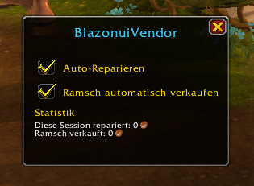

# BlazonuiVendor

Addon für World of Warcraft (Retail). Repariert deine Ausrüstung automatisch beim Händler
und verkauft automatisch Ramsch (graue Gegenstände) — beides einzeln an-/abschaltbar.

`/bv` öffnet ein eigenes Fenster mit Schaltern für beide Funktionen und einer kleinen
Session-Statistik (repariert/verkauft in Gold). Alternativ per Minimap-Icon (ziehbar) oder
über `Einstellungen → AddOns → BlazonuiVendor`. Schnell-Befehle: `/bv repair`, `/bv sell`.

Quellcode ist öffentlich einsehbar — siehe [LICENSE](LICENSE) für Nutzungsbedingungen.
Bugs/Vorschläge bitte über den [Discord](https://blazonui.de/join) (`/report`, `/suggest`),
nicht direkt als GitHub-Issue.

## Mitmachen

Siehe [CONTRIBUTING.md](CONTRIBUTING.md).
